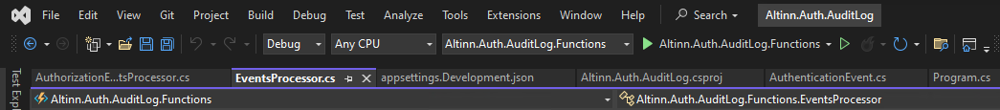
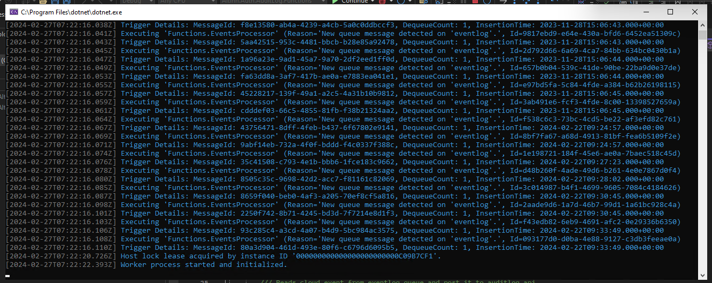
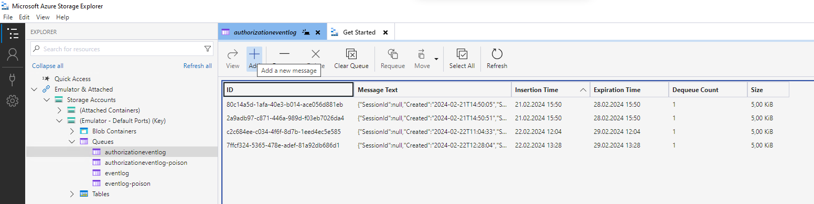

# Project Name: Audit Log
## Overview
The audit log component will be responsible for adding logs for authentication and authorization events.

## What is an Authentication Event?
The authenticate event is raised when a user logins into an altinn 3 application or send authentication request to authentication api.

## What is an Authorization Event?
The authorization event is raised when a user interacts with an altinn 3 application(it can be form or the new access management app), an authorization request sent via api call. For example when a user requests permission to instantiate/update an application.

## Architecture


### Components
The altinn platform cluster is the existing solution that will integrate with the auditlog solution.

### 1. Queue
The events generated by the authentication/authorization platform components are queued in authentication/authorization eventlog queues in the azure storage queue.

### 2. Auditlog Function App
The events in the queues are then processed by function application in azure and forwarded to the auditlog container app application. The authentication, authorization events are processed by respective event processors in the fucntion app.

### 3. Auditlog Container Application
The auditlog api maps the events to the database model and stores them in the database. The api exposes 2 different endpoints for authentication and authorization.

### 4. Database
The events are stored in the postgres database.

## Technologies
  - .NET 8.0
  - Azure Storage Queue
  - Azure Function App V4
  - Azure Container App
  - Azure Key Vault
  
## Setup Development Environment

### Prerequisites
The following tools must be installed on the local machine to manage the queue/database/code
 - Visual studio code/visual studio or any code editor
 - [Azure storage explorer](https://azure.microsoft.com/en-us/products/storage/storage-explorer)
 - [Postgres](https://www.postgresql.org/download/)
 - [Pgadmin to manage postgres database](https://www.pgadmin.org/download/)
 - [Azurite as a storage emulator](https://learn.microsoft.com/en-us/azure/storage/common/storage-use-azurite?tabs=visual-studio%2Cblob-storage)

### Configure
AppSettings

Set the workspacepath for the yuniql database. The workspace path is the path where the migration script folder is placed. For ex: 
```
"WorkspacePath": "Altinn.Auth.AuditLog/Migration"
```

Database Setup

Open the pgadmin tool and connect to the local database. Create a database auditlog.

###  Build Auditlog Api
Clone the code from the repository. Build & run the Altinn.Auth.AuditLog.csproj either from the command prompt or IDE.
The database setup or updated when the asp.net core host service starts up. This ensures that database is always at latest compatible state before operating the service.

The auditlog api will be available at
http://localhost:5166/
and the swagger documentation can be accessed at
http://localhost:5166/swagger/index.html

### Verify DB
Verify that auditlog database has the necessary schemas, tables. 

### Test
The api can be tested via postman. 

Endpoint: http://localhost:5166/auditlog/api/v1/authenticationevent

TestData:
```
{
    "created": "2023-06-14T02:39:37",
    "subjectuserid": 20001337,
    "resourcepartyid": 50001337,
    "resource": "app_skd_taxreport",
    "operation": "read",
    "contextrequestjson": "{\"Attributes\":[{\"Id\":null,\"Content\":null,\"Category\":\"urn:oasis:names:tc:xacml:1.0:subject-category:access-subject\",\"Attributes\":[{\"Issuer\":null,\"AttributeId\":\"urn:altinn:userid\",\"AttributeValues\":[{\"Value\":\"20001337\",\"DataType\":\"http://www.w3.org/2001/XMLSchema#string\",\"Elements\":[],\"Attributes\":[]}],\"IncludeInResult\":false}]},{\"Id\":null,\"Content\":null,\"Category\":\"urn:oasis:names:tc:xacml:3.0:attribute-category:action\",\"Attributes\":[{\"Issuer\":null,\"AttributeId\":\"urn:oasis:names:tc:xacml:1.0:action:action-id\",\"AttributeValues\":[{\"Value\":\"read\",\"DataType\":\"http://www.w3.org/2001/XMLSchema#string\",\"Elements\":[],\"Attributes\":[]}],\"IncludeInResult\":false}]},{\"Id\":null,\"Content\":null,\"Category\":\"urn:oasis:names:tc:xacml:3.0:attribute-category:resource\",\"Attributes\":[{\"Issuer\":null,\"AttributeId\":\"urn:altinn:org\",\"AttributeValues\":[{\"Value\":\"org1\",\"DataType\":\"http://www.w3.org/2001/XMLSchema#string\",\"Elements\":[],\"Attributes\":[]}],\"IncludeInResult\":false},{\"Issuer\":null,\"AttributeId\":\"urn:altinn:app\",\"AttributeValues\":[{\"Value\":\"app1\",\"DataType\":\"http://www.w3.org/2001/XMLSchema#string\",\"Elements\":[],\"Attributes\":[]}],\"IncludeInResult\":false},{\"Issuer\":null,\"AttributeId\":\"urn:altinn:partyid\",\"AttributeValues\":[{\"Value\":\"50001337\",\"DataType\":\"http://www.w3.org/2001/XMLSchema#string\",\"Elements\":[],\"Attributes\":[]}],\"IncludeInResult\":false}]}],\"XPathVersion\":null,\"CombinedDecision\":false,\"RequestReferences\":[],\"ReturnPolicyIdList\":false}",
    "decision": "Permit"
}
```

### Build and Run the function application

The function app can be run either from the visualstudio toolbar 


and you will be able to see an ouput window


The fucntion app when run locally is bound to the development storage privoded by azurite storage emulator. The function app will be triggered when there is a new queue message.

## Test the entire flow
Now that all the components are up and running, we can test the flow from the queue message to the database locally. In the real scenario, the authentication, authorization component will log the queue message to the storage queue but locally, open the Microsoft Storage Explorer, add a queue message manually.


click the Add button on the authorizationeventlog queue and for example add the queue message below

```
{"SessionId":null,"Created":"2024-02-21T14:50:05","SubjectUserId":1,"SubjectOrgCode":"","SubjectOrgNumber":null,"SubjectParty":null,"ResourcePartyId":1000,"Resource":"app_skd_taxreport","InstanceId":"1000/26133fb5-a9f2-45d4-90b1-f6d93ad40713","Operation":"read","TimeToDelete":"2027-02-21T14:50:05","IpAdress":null,"ContextRequestJson":"{\u0022ReturnPolicyIdList\u0022:false,\u0022CombinedDecision\u0022:false,\u0022XPathVersion\u0022:null,\u0022Attributes\u0022:[{\u0022Id\u0022:null,\u0022Content\u0022:null,\u0022Attributes\u0022:[{\u0022Issuer\u0022:null,\u0022AttributeId\u0022:\u0022urn:altinn:userid\u0022,\u0022IncludeInResult\u0022:false,\u0022AttributeValues\u0022:[{\u0022Value\u0022:\u00221\u0022,\u0022DataType\u0022:\u0022http://www.w3.org/2001/XMLSchema#string\u0022,\u0022Attributes\u0022:[],\u0022Elements\u0022:[]}]},{\u0022Issuer\u0022:null,\u0022AttributeId\u0022:\u0022urn:altinn:rolecode\u0022,\u0022IncludeInResult\u0022:false,\u0022AttributeValues\u0022:[{\u0022Value\u0022:\u0022regna\u0022,\u0022DataType\u0022:\u0022http://www.w3.org/2001/XMLSchema#string\u0022,\u0022Attributes\u0022:[],\u0022Elements\u0022:[]},{\u0022Value\u0022:\u0022dagl\u0022,\u0022DataType\u0022:\u0022http://www.w3.org/2001/XMLSchema#string\u0022,\u0022Attributes\u0022:[],\u0022Elements\u0022:[]},{\u0022Value\u0022:\u0022apiadm\u0022,\u0022DataType\u0022:\u0022http://www.w3.org/2001/XMLSchema#string\u0022,\u0022Attributes\u0022:[],\u0022Elements\u0022:[]}]}],\u0022Category\u0022:\u0022urn:oasis:names:tc:xacml:1.0:subject-category:access-subject\u0022},{\u0022Id\u0022:null,\u0022Content\u0022:null,\u0022Attributes\u0022:[{\u0022Issuer\u0022:null,\u0022AttributeId\u0022:\u0022urn:oasis:names:tc:xacml:1.0:action:action-id\u0022,\u0022IncludeInResult\u0022:false,\u0022AttributeValues\u0022:[{\u0022Value\u0022:\u0022read\u0022,\u0022DataType\u0022:\u0022http://www.w3.org/2001/XMLSchema#string\u0022,\u0022Attributes\u0022:[],\u0022Elements\u0022:[]}]}],\u0022Category\u0022:\u0022urn:oasis:names:tc:xacml:3.0:attribute-category:action\u0022},{\u0022Id\u0022:null,\u0022Content\u0022:null,\u0022Attributes\u0022:[{\u0022Issuer\u0022:null,\u0022AttributeId\u0022:\u0022urn:altinn:instance-id\u0022,\u0022IncludeInResult\u0022:true,\u0022AttributeValues\u0022:[{\u0022Value\u0022:\u00221000/26133fb5-a9f2-45d4-90b1-f6d93ad40713\u0022,\u0022DataType\u0022:\u0022http://www.w3.org/2001/XMLSchema#string\u0022,\u0022Attributes\u0022:[],\u0022Elements\u0022:[]}]},{\u0022Issuer\u0022:null,\u0022AttributeId\u0022:\u0022urn:altinn:org\u0022,\u0022IncludeInResult\u0022:false,\u0022AttributeValues\u0022:[{\u0022Value\u0022:\u0022skd\u0022,\u0022DataType\u0022:\u0022http://www.w3.org/2001/XMLSchema#string\u0022,\u0022Attributes\u0022:[],\u0022Elements\u0022:[]}]},{\u0022Issuer\u0022:null,\u0022AttributeId\u0022:\u0022urn:altinn:app\u0022,\u0022IncludeInResult\u0022:false,\u0022AttributeValues\u0022:[{\u0022Value\u0022:\u0022taxreport\u0022,\u0022DataType\u0022:\u0022http://www.w3.org/2001/XMLSchema#string\u0022,\u0022Attributes\u0022:[],\u0022Elements\u0022:[]}]},{\u0022Issuer\u0022:null,\u0022AttributeId\u0022:\u0022urn:altinn:partyid\u0022,\u0022IncludeInResult\u0022:false,\u0022AttributeValues\u0022:[{\u0022Value\u0022:\u00221000\u0022,\u0022DataType\u0022:\u0022http://www.w3.org/2001/XMLSchema#string\u0022,\u0022Attributes\u0022:[],\u0022Elements\u0022:[]}]},{\u0022Issuer\u0022:null,\u0022AttributeId\u0022:\u0022urn:altinn:appresource\u0022,\u0022IncludeInResult\u0022:false,\u0022AttributeValues\u0022:[{\u0022Value\u0022:\u0022events\u0022,\u0022DataType\u0022:\u0022http://www.w3.org/2001/XMLSchema#string\u0022,\u0022Attributes\u0022:[],\u0022Elements\u0022:[]}]}],\u0022Category\u0022:\u0022urn:oasis:names:tc:xacml:3.0:attribute-category:resource\u0022}],\u0022RequestReferences\u0022:[]}","Decision":"Permit"}
```
Now, this message will be processed by the function app, sent to the auditlog api and stored in the database. The database is queried to verify that the queue message is stored in the database.

## Build, Deploy & Release

## Pull Request Labels
pr-labeler action is triggered for each pull request. Based on the branch name, this action adds a label to the pull request. The configuration for the labels can be found here.

## Deploy
### Auditlog Container application / function application
Code is continously integrated and deployed to all testing environments (AT environments). [build-deploy-at](https://github.com/Altinn/altinn-auth-audit-log/blob/main/.github/workflows/build-deploy-at.yml) is triggered when a pull request is merged into main branch. On each run, the code is built, packaged and published to Github Container registry as altinn-auth-audit-log. Each image is tagged with the github commit sha. The package is then deployed to an azure container app in testing environment. The environment variables, secrets for the action are setup in the repository settings.

### Auditlog Function Application
Code is continously integrated and deployed to all testing environments (AT environments). The code from the main branch is published to the function app in different environments. In the future, the function app will also be containerized.

## Release
### Auditlog Container Application / Function application
The application has a release every wednesday. [create-release-draft](https://github.com/Altinn/altinn-auth-audit-log/blob/main/.github/workflows/create-release-draft.yml) action is triggered every wednesday 00.00. This action drafts release notes, formats a release version f.ex 2024.3.19. The action drafts the release on different categories. The changes are categorized based on the pull request label. F.ex, A PR with a label bugfix is categorized under bug. The detailed release draft configuration can be found [here](https://github.com/Altinn/altinn-auth-audit-log/blob/main/.github/release-drafter.yml). The deploy in charge for the week, publishes the drafted release notes. The release action then triggers [deploy-after-release](https://github.com/Altinn/altinn-auth-audit-log/blob/main/.github/workflows/deploy-after-release.yml) of the release version. 

### Deploy a specific commit# to specific environment
In some scenarios, there will be a necessity to deploy a specific commit/branch to a specific environment. [build-deploy-to-environment](https://github.com/Altinn/altinn-auth-audit-log/blob/main/.github/workflows/build-deploy-to-environment.yml) action can be used to build/ deploy a specific commitid.